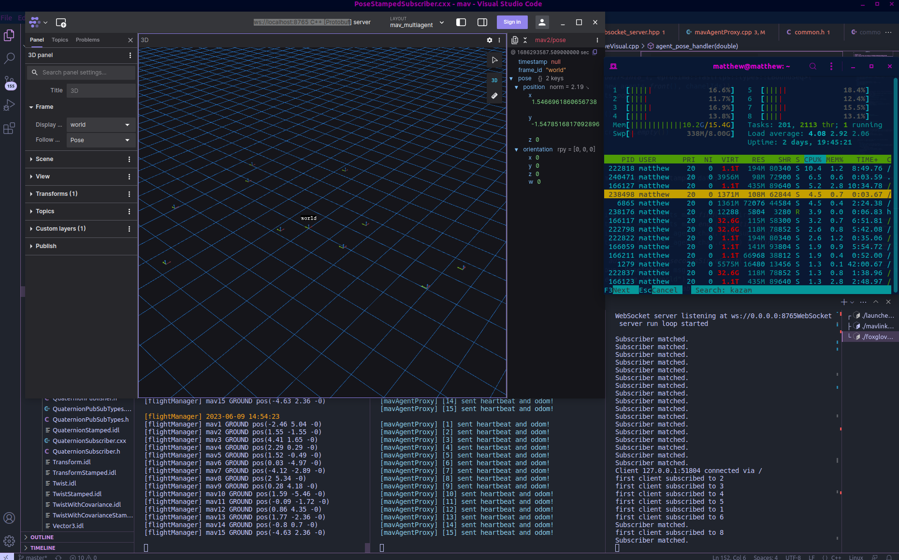

# Mavlink Flight Manager

To create a flight manager framework with **mavsdk** and **fastdds**, using **OMG idl** generated ROS2 types 

### Mavlink + DDS + Foxglove


## Installation and Information

### Generation of ROS2 Fast-DDS message types
Do look into the `external/msgs_idl` submodule to understand more

## Dependencies
### **mavsdk**
```bash
# Download mavsdk
cd
git clone https://github.com/mavlink/MAVSDK.git mavsdk
cd mavsdk
git checkout v1.4.13
git submodule update --init --recursive
cmake -DCMAKE_BUILD_TYPE=Debug -Bbuild/default -H.
cmake --build build/default -j4
sudo cmake --build build/default --target install
```
### **foxglove-websocket**
Follow the guide in https://github.com/matthewoots/foxglove-websocket

## Setup
```bash
git clone git@github.com:matthewoots/mav_flight_manager.git --recursive
cd mav_flight_manager
cmake -Bbuild -H.
cmake --build build -j4
cd build
# run the executables below
```

## Run
```bash
# launcher executable runs both real and sim
#   - launcher will launch the ./flight_manager internally depending on the settings
#   - to test it out, launch px4 sitl, and the flight manager will pick up the mavlink system
# example
./launcher udp://127.0.0.1:14580 sim 1
./launcher --help # To find out more on how to launch

# visualization server (foxglove)
./foxglove_visual

# manager to command mission
./mission_manager 

# manager to command mission
./mavlinkProxy <type-of-conenction> <number-of-drones>
./mavlinkProxy --help # To find out more on how to launch
```

## Extra notes
To know how to generate `mavlink` messages to be used in c++ modules
```bash
git clone git@github.com:mavlink/mavlink.git
cd mavlink
git checkout 1.0.12
git submodule update --init --recursive
python3 -m pymavlink.tools.mavgen --lang=C++11 --wire-protocol=2.0 --output=generated/include/mavlink/v2.0 message_definitions/v1.0/common.xml
```
